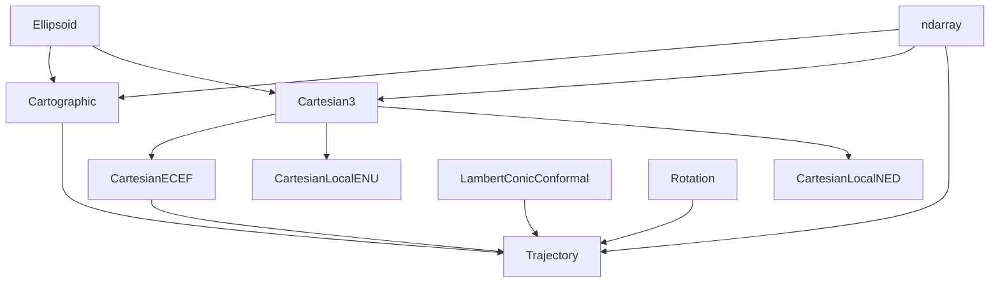

# SAR Geometry

A Python package for Synthetic Aperture Radar (SAR) geometry calculations.

## Installation

1. **Pre-requisites**: Make sure you have [Conda](https://docs.anaconda.com/miniconda/) installed on your system. Then, create a new environment and activate it:

```bash
conda create -n sargeom-env python=3.13
conda activate sargeom-env
```

2. **Install the package**: Next, you can install the plugin directly from GitHub using [pip](https://pypi.org/project/pip/):

```bash
pip install git+https://github.com/oleveque/sargeom.git@latest
```

If you want to add the package to your dependencies, you can add it to your `pyproject.toml`:

```toml
[project]
dependencies = [
    "sargeom @ git+https://github.com/oleveque/sargeom@v0.2.0"
]
```

Or to your `requirements.txt` file:

```bash
sargeom @ git+https://github.com/oleveque/sargeom@v0.2.0
```

For more information on the latest updates, check the [CHANGELOG](CHANGELOG.md).

3. **Development mode**: If you want to contribute to the package or run it in development mode, clone the repository and install in editable mode with optional dependencies:

```bash
git clone https://github.com/oleveque/sargeom.git
cd sargeom
pip install -e .[dev,docs,examples]
```

### Optional Dependencies

The package includes optional dependencies for different use cases:

- **Documentation**: `pip install sargeom[docs]` - for building documentation
- **Examples**: `pip install sargeom[examples]` - for running examples and visualization
- **Development**: `pip install sargeom[dev]` - for package development and publishing
- **All optional**: `pip install sargeom[docs,examples,dev]` - install everything

## Dependency relationships



## Issues

If you encounter any problems, please [file an issue](https://github.com/oleveque/sargeom/issues) with a detailed description.
Your feedback is valuable in improving the package.

## License

This project is licensed under the [ISC License](LICENSE.md).
